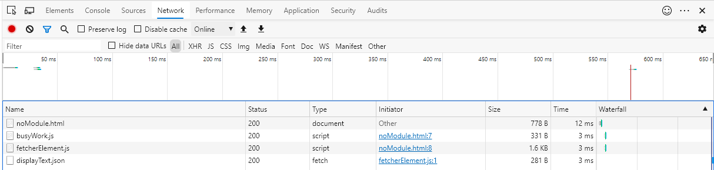
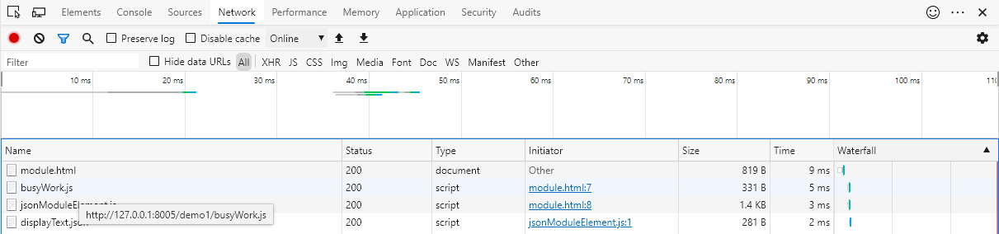
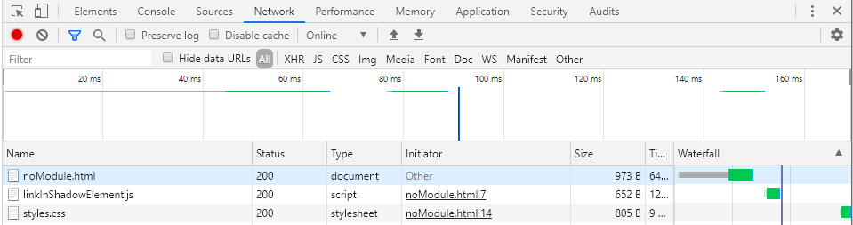
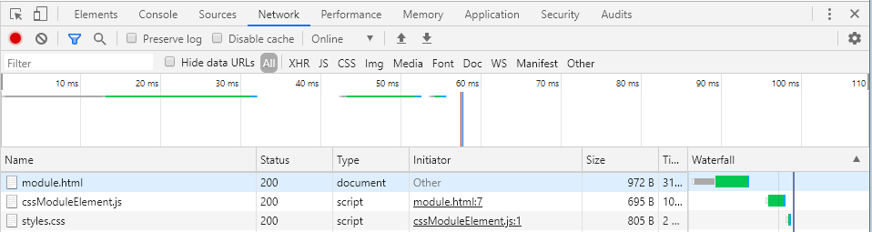
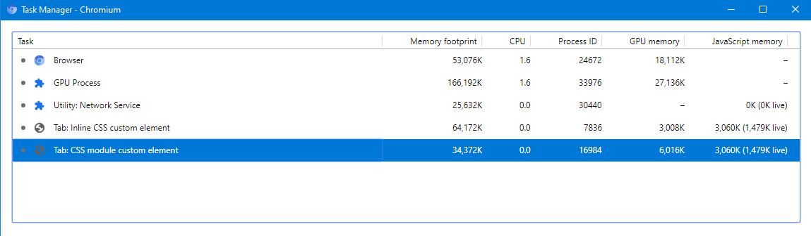

# JSON/CSS Module notes
[JSON modules](https://github.com/whatwg/html/pull/4407) and [CSS modules](https://github.com/w3c/webcomponents/blob/gh-pages/proposals/css-modules-v1-explainer.md) provide several ergonomic benefits for web component developers.  They provide easy integration into the JavaScript module graph with automatic deduping of dependencies, and eliminate the need to manually manage `fetch()`es or pollute the DOM with extra `<style>` and `<link rel="stylesheet">` elements.

Additionally, there are important quantitative performance advantages to JSON and CSS modules over the current equivalents.  This document describes these advantages and illustrates them with code samples.

## A performance-equivalent JSON module can't be created with JavaScript modules

A naive attempt to replicate the functionality of JSON modules with a JavaScript module wrapper might look something like this:

```JavaScript
let responseJSONObject;

fetch("./data.json")
    .then((response) => {
        return response.text();
    })
    .then((responseText) => {
        responseJSONObject = JSON.parse(responseText);
    });

export default responseJSONObject;
```

But, because the fetch() completes asynchronously the importer can't safely use the imported JSON object immediately.  So, the module can instead export a Promise:

```JavaScript
let responseJSONPromise = fetch("./data.json")
    .then((response) => {
        return response.text();
    })
    .then((responseText) => {
        return JSON.parse(responseText);
    });

export default responseJSONPromise;
```

Now, however, importers are saddled with the responsibility of waiting for the promise to resolve and of re-exporting the Promise if they want to export dependencies of their own.

These problems will eventually be resolved by [Top-level Await](https://github.com/tc39/proposal-top-level-await) when it becomes standardized.
Running with the experimental V8 [--js-flags="--harmony-top-level-await"](https://bugs.chromium.org/p/v8/issues/detail?id=9344),
the simulated JSON module can be written the following way:

```JavaScript
let responseJSONObject;

await fetch("./data.json")
    .then((response) => {
        return response.text();
    })
    .then((responseText) => {
        responseJSONObject = JSON.parse(responseText);
    });

export default responseJSONObject;
```

From the perspective of the importer this is ergonomically pretty much equivalent to native JSON
modules.  However, static JSON modules can do better performance-wise.  In the example above,
the `fetch()` for data.json doesn't start until the JavaScript in the module executes.  This could be delayed by other dependencies in the module graph being slow to load, or by longer executions of other modules that appear earlier in the module graph's execution order.

With JSON modules, on the other hand, browsers can initiate
the fetch for a JSON file as soon as the importing module is parsed, prior to module linking or execution.  [Demo 1](#demo-1) illustrates this difference.

## Demo 1
### [Fetches for JSON and CSS modules starts before script execution](https://dandclark.github.io/json-css-module-notes/demo1/index.html)
[https://dandclark.github.io/json-css-module-notes/demo1/index.html](https://dandclark.github.io/json-css-module-notes/demo1/index.html)

(The JSON modules demo requires Chrome or Edge launched with --enable-blink-features=JSONModules).

This demo compares two similar custom elements written as a JavaScript module, each of which requires a JSON resource.  The first custom element consumes the JSON by `fetch()`ing it, and the second by `import`ing it as a module.  For both custom elements, an additional `busyWork.js` module is included in the module graph before the module containing the custom element definition.  This is a stand-in for any arbitrary script that might appear in the module graph prior to the custom element definition, such as a JavaScript libary.

In the `fetch()` version of the custom element, the JSON file isn't fetched until after the code in `busyWork.js` has finished executing, where in the JSON module version of the custom element the JSON file is fetched prior to any script execution.  In a real-world scenario where there was network delay in fetching the file, or where there are significant amounts of computation that can only run after the JSON resource is loaded, there could be a significant, user-percieved performance difference.

#### With fetch():


#### With JSON module:


## Demo 2
### [CSS modules vs `<link>` elements in shadow roots](https://dandclark.github.io/json-css-module-notes/demo2/index.html)
[https://dandclark.github.io/json-css-module-notes/demo2/index.html](https://dandclark.github.io/json-css-module-notes/demo2/index.html)

(There is no general CSS modules browser support as of this writing; that part of the demo was created and tested using a custom Chromium build).

This demo compares two similar custom elements written as a JavaScript module, each of which loads its styles from a separate `styles.css` file.  The first custom element applies its styles by adding the styles via a `<link rel="stylesheet">` in the custom element shadow root.  The second loads its styles via a CSS module.

With the `<link>` element approach, the `<link>` isn't processed until an instance of the custom element is inserted into the document.  In [demo2/NoModule.html](demo2/noModule.html), there is a delay before an instance of the custom element is created and inserted (to simulate, for example, a custom element that is only added based on some user action) and thus a corresponding delay before styles.css is fetched.

#### With `<link rel="stylesheet">` in shadowRoot:


Using CSS modules, styles.css is fetched as part of processing the module graph, before any JavaScript is executed.

#### With CSS module:


If `styles.css` was slow to arrive over the network, or was large enough to take a nontrivial amount of time to parse, front-loading the work could result in a user-percievable difference in how early the styles are applied to the page.


## Demo 3
### [CSS/JSON modules have a lower memory footprint than inlining the CSS/JSON as a JavaScript string](https://dandclark.github.io/json-css-module-notes/demo3/index.html)
[https://dandclark.github.io/json-css-module-notes/demo3/index.html](https://dandclark.github.io/json-css-module-notes/demo3/index.html)

(There is no general CSS modules browser support as of this writing; that part of the demo was created and tested a custom Chromium build).

An alternative non-module approach for packaging CSS/JSON in a custom element is to inline the content as a JavaScript string rather than `fetch()`ing it dynamically.  This string can be fed into a [Constructed Stylesheet](https://developers.google.com/web/updates/2019/02/constructable-stylesheets) or a `<style>` element.
This eliminates any concerns about a a delay in the `fetch()` as outlined above.  However, in addition to the clunky developer ergonimics
of a bunch of inlined JavaScript string content in one's custom element JS logic, this approach has a quantifiable memory cost.  This is due to the fact that the original JS string lives on alongside the CSSStyleSheet or JSON object that it is eventually parsed into.  Whereas with CSS/JSON modules, nothing persists but the CSSStylesheet or JSON object.

[Demo3](https://dandclark.github.io/json-css-module-notes/demo3/index.html) linked above illustrates this difference.  Both the no-module and the module case load a custom element that pulls in ~30MB of CSS.  The no-module case imports inlines it in the JS file defining the custom element, in the style of some of the [existing Chromium layered API elements](https://cs.chromium.org/chromium/src/third_party/blink/renderer/core/script/resources/layered_api/elements/).  The module case imports the same CSS as a CSS module.  After reaching steady-state, the memory difference is around the same ~30MB as the raw CSS text:



This steady state is reached after leaving both tabs in the background for ~60 seconds.  Before this final garbage collection, the difference is even more stark; in my observations the inline CSS case hovers around ~95MB for the first 60 seconds, whereas the CSS modules tab goes down to ~38MB within the first few seconds.
