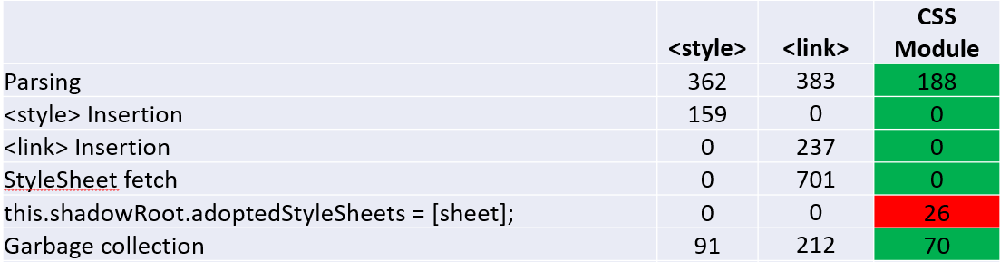

# JSON/CSS Module notes
[JSON modules](https://github.com/whatwg/html/pull/4407) and [CSS modules](https://github.com/w3c/webcomponents/blob/gh-pages/proposals/css-modules-v1-explainer.md) provide several ergonomic benefits for web component developers.  They provide easy integration into the JavaScript module graph with automatic deduping of dependencies, and eliminate the need to manually manage `fetch()`es or pollute the DOM with extra `<style>` and `<link rel="stylesheet">` elements.

Additionally, there are important behavioral differences and quantitative performance wins to JSON and CSS modules over the current equivalents.  This document describes these advantages and illustrates them with code samples.

## An equivalent to JSON modules can't be built with JavaScript modules

A naive attempt to replicate the functionality of JSON modules with a JavaScript module wrapper might look something like this:

```JavaScript
let jsonObject;

fetch("./data.json")
    .then((response) => {
        return response.text();
    })
    .then((responseText) => {
        jsonObject = JSON.parse(responseText);
    });

export default jsonObject;
```

But, because the fetch() completes asynchronously the importer can't safely use the imported JSON object immediately.  So, the module can instead export a Promise:

```JavaScript
let responseJSONPromise = fetch("./data.json")
    .then((response) => {
        return response.text();
    })
    .then((responseText) => {
        return JSON.parse(responseText);
    });

export default responseJSONPromise;
```

Now, however, importers are saddled with the responsibility of waiting for the Promise to resolve, and if they want to export anything that depends on the result of the originally imported Promise they must themselves export a Promise.

This necessity to export Promises will eventually be resolved by [Top-level Await](https://github.com/tc39/proposal-top-level-await) when it becomes standardized.
Running with the experimental V8 [--js-flags="--harmony-top-level-await"](https://bugs.chromium.org/p/v8/issues/detail?id=9344),
the simulated JSON module can be written the following way:

```JavaScript
let jsonObject;

await fetch("./data.json")
    .then((response) => {
        return response.text();
    })
    .then((responseText) => {
        jsonObject = JSON.parse(responseText);
    });

export default jsonObject;
```

or alternatively:

```JavaScript
let response = await fetch("./data.json")
let responseText = await response.text();
let jsonObject = JSON.parse(responseText);
export default jsonObject;
```

From the perspective of the importer this is ergonomically more or less equivalent to native JSON modules.  However it still has these disadvantages:
 - The above code snippets take two network requests: the `import` of the wrapper JS module and its `fetch()` of the JSON.  A native JSON module just has a single `import` for the JSON.
 - JSON module dependencies are resolved statically before module graph evaluation, so if a JSON module fails to load it will block any code in the module graph from running.  If a dynamically `fetch()`ed JSON dependency fails to load, part of the module graph could already have executed and caused side-effects.
 - Native JSON modules is convenient; it's a bit simpler for devs if they don't have to include the manual `fetch()` and `JSON.parse()` stuff in their code.

And the above depends on the standardization and broad adoption of top-level await.  Until that happens, devs are stuck exporting a Promise that the importer needs to deal with.

## CSS Module Performance/Memory examples:

### Demo 1: [Overhead from `<style>` or `<link>` elements in custom element shadow root](https://dandclark.github.io/json-css-module-notes/demo1/index.html)

A common way of applying a custom element's styles is to include a `<style>` element or (perhaps less commonly?) a `<link>` element in the custom element's shadow root.  This suffers from the problem that for each instance of the shadow element that exists on the page, there is an additional copy of the `<style>`/`<link>` element that gets stamped out.  It costs CPU cycles to instantiate these extra elements, and do the necessary work when they are connected to the document.  There is also memory overhead for their allocations.

A custom element that pulls in its styles with CSS module, however, only processes the stylesheet one time, when the sheet is imported, and there is no cost for an additional element in each custom element instance's shadow root.  For a page that has many instances of the custom element, this can result in percievable performance and memory differences.

[Demo 1](https://dandclark.github.io/json-css-module-notes/demo1/index.html) illustrates this difference with a custom element written 3 different ways: with a `<style>` element in each shadow root, with a `<link>` element in each shadow root, and with a single CSS module applied to each shadow root's `adoptedStyleSheets`.  To make the performance differences easily distinguishable, each page includes 15,000 instances of the respective custom element version.

The following graph is characteristic of the results:


Of course the absolute times will change per machine, but I observe a similar ratio of load times across different environments.

Digging into the performance traces, we found that the gains came from the areas we expected:



These results make sense; for the `<link>` and `<style>` approaches, each custom element instance must have its own instance of one of these elements.  It takes time to allocate this element, and process its various rules for insertion into the DOM tree.  For example, setting up all of the StyleSheet fetches for the `<link>` element approach takes a nontrivial amount of time even though they all end up hitting the cache.  With CSS modules on the other hand, there is just a single CSSStyleSheet instance for the entire page.

There are also memory savings from omitting the extra elements.  After reaching baseline (putting tabs in background and waiting for final GC at ~60 seconds) I see these numbers like this:


### Demo 2:  [CSS/JSON modules have a lower memory footprint than inlining the CSS/JSON as a JavaScript string](https://dandclark.github.io/json-css-module-notes/demo2/index.html)
[https://dandclark.github.io/json-css-module-notes/demo2/index.html](https://dandclark.github.io/json-css-module-notes/demo2/index.html)

(There is no general CSS modules browser support as of this writing; that part of the demo was created and tested a custom Chromium build).

An alternative non-module approach for packaging CSS/JSON in a custom element is to inline the content as a JavaScript string rather than `fetch()`ing it dynamically, and feeding it into a [Constructed Stylesheet](https://developers.google.com/web/updates/2019/02/constructable-stylesheets).
This eliminates the issues in Demo 1 where extra work is repeated for each custom element instance.  However, in addition to the clunky developer ergonimics
of a bunch of inlined JavaScript string content in one's custom element JS logic, this approach can still have an extra memory cost.  This is due to the fact that the original JS string lives on alongside the CSSStyleSheet or JSON object that it is eventually parsed into.  Whereas with CSS/JSON modules, nothing persists but the CSSStylesheet or JSON object.

[Demo 2](https://dandclark.github.io/json-css-module-notes/demo2/index.html) illustrates this difference.  Both the no-module and the module case load a custom element that pulls in ~30MB of CSS.  The no-module case imports inlines it in the JS file defining the custom element, in the style of some of the [existing Chromium layered API elements](https://cs.chromium.org/chromium/src/third_party/blink/renderer/core/script/resources/layered_api/elements/).  The module case imports the same CSS as a CSS module.  After reaching steady-state, the memory difference is around the same ~30MB as the raw CSS text:


This steady state is reached after leaving both tabs in the background for ~60 seconds.  Before this final garbage collection, the difference is even more stark; in my observations the inline CSS case hovers around ~95MB for the first 60 seconds, whereas the CSS modules tab goes down to ~38MB within the first few seconds.

### Demo 3: [Delayed stylesheet fetching for `<link>` elements in shadow roots](https://dandclark.github.io/json-css-module-notes/demo3/index.html)
[https://dandclark.github.io/json-css-module-notes/demo3/index.html](https://dandclark.github.io/json-css-module-notes/demo3/index.html)

(There is no general CSS modules browser support as of this writing; that part of the demo was created and tested using a custom Chromium build).

This demo shows an additional disadvantage to using `<link>` in a shadow root to load a custom element's styles.  It compares two similar custom elements written as  JavaScript modules, each of which loads its styles from a separate `styles.css` file.  The first custom element applies its styles by adding the styles via a `<link rel="stylesheet">` in the custom element shadow root.  The second loads its styles via a CSS module.

With the `<link>` element approach, the `<link>` isn't processed until an instance of the custom element is inserted into the document.  In [demo3/NoModule.html](demo3/noModule.html), there is a delay before an instance of the custom element is created and inserted (to simulate, for example, a custom element that is only added based on some user action) and thus a corresponding delay before styles.css is fetched.

#### With `<link rel="stylesheet">` in shadowRoot:


Using CSS modules, styles.css is fetched as part of processing the module graph, before any JavaScript is executed.

#### With CSS module:


If `styles.css` was slow to arrive over the network, or was large enough to take a nontrivial amount of time to parse, front-loading the work could result in a user-percievable difference in how early the styles are applied to the page.

### Demo 4: [JSON modules are faster than inline JavaScript objects](https://dandclark.github.io/json-css-module-notes/demo4/index.html)
[https://dandclark.github.io/json-css-module-notes/demo4/index.html](https://dandclark.github.io/json-css-module-notes/demo4/index.html)

In V8, it's faster to load a JSON object by feeding a string to JSON.parse() than by creating the equivalent JavaScript object directly.  That is, this:
```JavaScript
const json = JSON.parse('{ "color": "blue", "shape": "circle", ...}');
```

Will tend to be faster than this:
```JavaScript
const json = { color: "blue", shape: "circle", ...};
```

[This V8 dev blog post](https://v8.dev/blog/cost-of-javascript-2019#json) goes into more detail, including V8 performance data.  Put simply, JSON.parse is cheaper because the JSON format is significantly simpler than the JavaScript language, so parsing it can be done much more quickly.

JSON modules share the performance advantage of JSON.parse, because they basically do a JSON.parse under the hood; at no point does the content of a JSON module need to be parsed as JavaScript.

I've placed a simple demo of this difference [here](https://dandclark.github.io/json-css-module-notes/demo4/index.html).  Both versions load the same 35 MB of JSON content.  One loads it as a JSON module and the other inlines the content as a JavaScript object.  Over 10 runs, all from a cold start, I observe the JSON module version loading in an average of 581 ms while the JS object version takes 1769 ms.

Another alternative is to inline the content as a JS string fed directly to JSON.parse, rather than going through a JSON module.  However, this approach can easily suffer from the same pitfall outlined in [Demo 2](https://dandclark.github.io/json-css-module-notes/demo2/index.html) where the string is never garbage collectible, resulting in unnecessary memory bloat relative to the JSON modules approach.

Sample JSON date obtained (and modified to reduce size) from [here](https://github.com/zemirco/sf-city-lots-json); see [LICENSE.txt](License.txt) file.